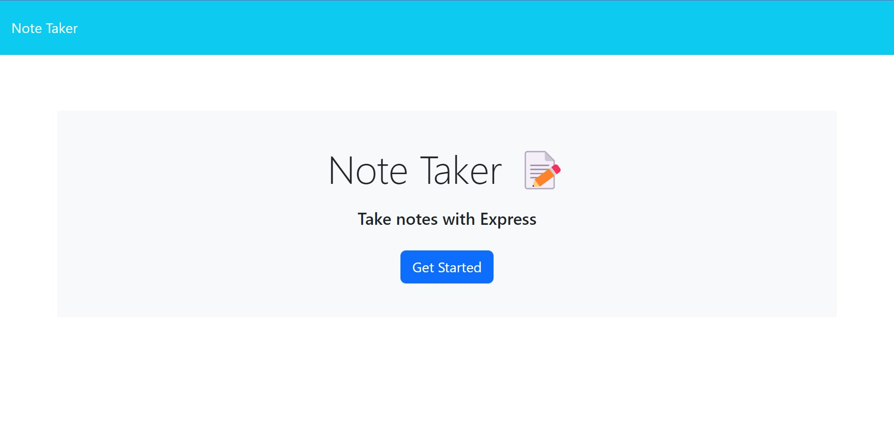
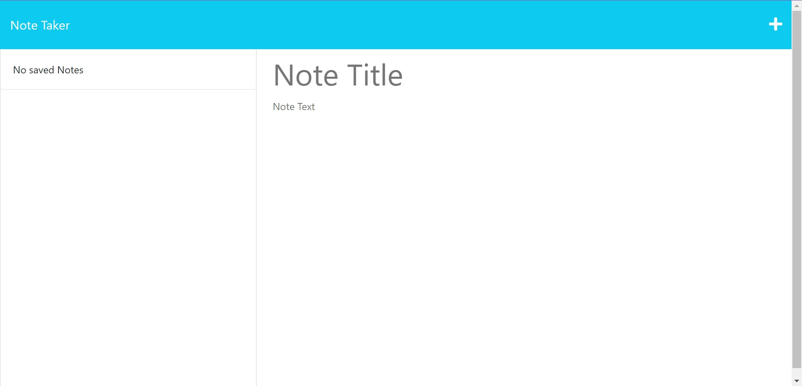

# Note-Taker-App

Note taking application using backend storage with the user adding and removing data from the application's json file using Express.js

## Description

This application was created by using Express.js on the backend of the app's functionality. The application includes 2 backend JavaScript files with a direct relationship- the first being server.js, which maps the API's direction and navigation via its unique link. The second, being the note.js file which defines the API's capabilities and functionality.

## Installation

To view this project, it requires that a browser be installed on your preferred device. The browser can be any one of your choosing. To view, enter the following URL to the address bar of said browser:

https://note-taker-tlc.herokuapp.com/

## Usage

When viewing the website, it should resemble the following images. Included are screenshots of how it should look in your desired web browser. If you have any issues viewing, please contact me via email at TinaTheDev91@gmail.com.

## Credits and Mentions

Thank you to my instructor Suarav for teaching us Express.js.

The code in this project references the code within Mini Project of the Express.js Module. The files reference the featured tips.js (to my notes.js), server.js (to my server.js) as well as the installed installed helpers and middleware folders.